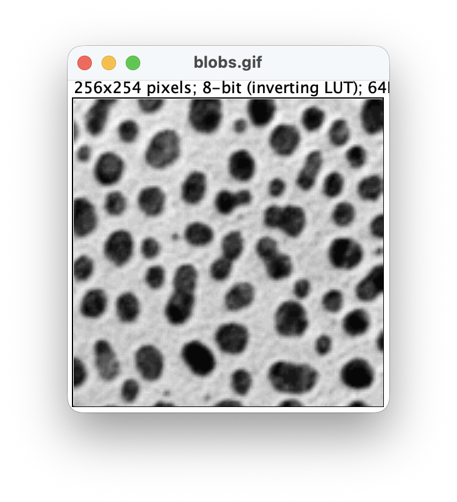
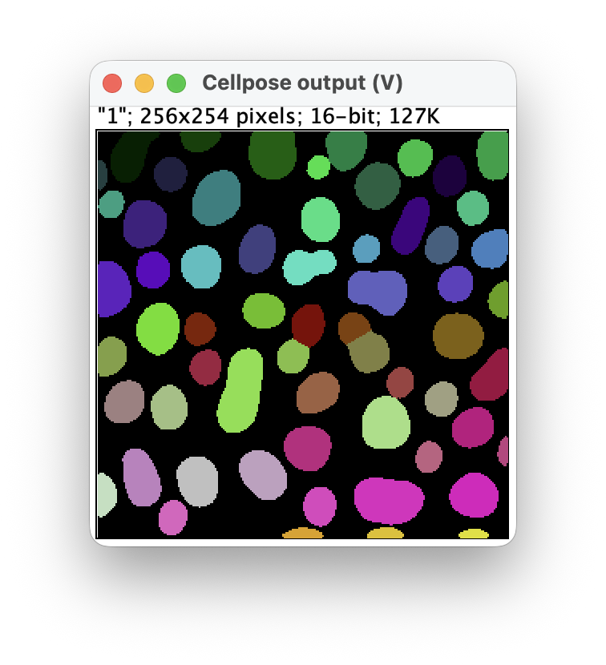
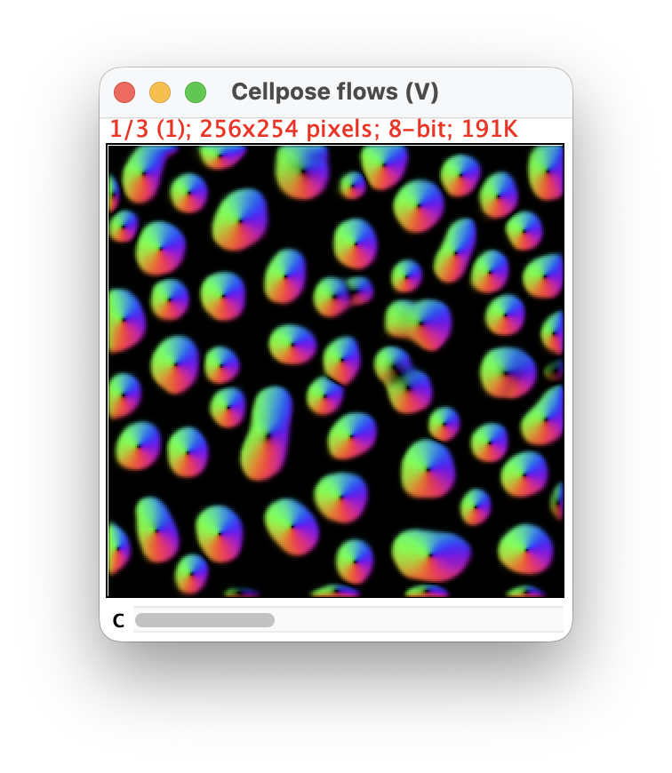

[](https://github.com/Image-Analysis-Hub/imglib2-cellpose/actions/workflows/build.yml)

# ImgLib2 Cellpose

Running Cellpose 3 and 4 from Java with [Appose](https://apposed.org/), using [ImgLib2](https://imglib2.net/imglib2/) data structure.

This small library is meant as a go to for Java developers who want to use Cellpose in their projects, without having to worry about the details of how to call Python from Java.
The use of ImgLib2 lightweight data structure allows being agnostic to how images are managed in your final application.
To see an example in Fiji plugin on this library, check the [Cellpose-Appose](https://imagej.net/plugins/cellpose-appose) plugin.

## Appose and running the library the first time

> [!WARNING]  
> As this library is based on Appose, the first time you run Cellpose 3 or Cellpose 4, a python environment with the requested Cellpose version will be automatically downloaded (via pixi) and installed in your home `.local\shared\appose` directory, which will take some time. 

The environments are managed by [pixi](https://pixi.prefix.dev/latest/), and Appose will download it if you don't have it installed on your system, which also will take some time the first run. So you need to be connected to the internet. 

The next time you use library, the environment will be directly activated and calls will be much faster. So don't panick if not much happens for a while the first time.  

Once installed, the environment will look like this (on Mac, with no NVIDIA GPT):

```zsh
# ~/.local/share/appose/cellpose-appose 
❯ ls -a
.         ..        .pixi     pixi.lock pixi.toml
❯ ls .pixi
envs
❯ ls .pixi/envs
cp3-cpu cp4-cpu
```
On windows and linux, you will see other envs with explicit torch version to support NVIDIA GPUs.
These environments are perfectly fonctional and you can use them separately to run Cellpose 3 and Cellpose 4 from other frameworks. They don't include Cellpose GUI.

Check the `~/.local/share/appose/cellpose-appose/pixi.toml` file for details.

## Basic usage

Basic usage, e.g. for Cellpose 3:

```java
// Input
final RandomAccessibleInterval< UnsignedByteType > input = ...
// You need to specify the dimensionality of your input
final AxisInfo inputAxes = AxisInfo.XY;

// Get messages about installing and processing, see below
ApposeTaskListener listener = ApposeTaskListener.STD;

// Specify the parameters for Cellpose 3
Cellpose3Parameters params = Cellpose3Parameters.builder()
    .model( Cellpose3BuiltinModels.CYTO2 )
    .channels( 1, 0 ) // 1-based, like Cellpose
    .computeFlows( true ) // flows output won't be null then.
    .build();

// Execute Cellpose 3
CellposeOutput< UnsignedShortType > output = Cellpose.cellpose3( input, inputAxes, params, listener );

// The output.
RandomAccessibleInterval< UnsignedShortType > labels = output.labels;
RandomAccessibleInterval< UnsignedByteType > flows = output.flows;
```
<p float="left">
    
    
    
<p>

The `Cellpose` gateway class also has a `cellpose4` method, with similar parameters, to run Cellpose 4.

These methods can process any kind of 5D input, from a 'XYCZT' combination of axes. You need to specify what axis is what with the `AxisInfo` record. It has constant for common siutations, that assume the axes order is 'XYCZT'.

> [!WARNING]  
> You can input with axes in any order, but the **X and Y axes must be the first two and must be present**. If not an exception will be thrown.

When processing 'XYZT' or 'XYCZT' inputs (5D images), the gateway processes each time-point one after another, because the Python Cellpose does not support 5D inputs. All other cases are batched in one Cellpose call.


## Flows ouput

If in your parameters you set `computeFlows` to `true` (see below), the `CellposeOutput` output will include the flows computed by Cellpose. We chose to simply output the RGB representation of the flows, which is the one shown in the Cellpose GUI, and which is a `RandomAccessibleInterval< UnsignedByteType >` with 3 channels. 

## Output type and number of labels

In the example above, the output labels are of type `UnsignedShortType`, which means that the maximum number of labels is 65,535. If you expect more labels, you can use `UnsignedIntType` instead, which allows for up to 4B labels.
The `Cellpose` gateway has methods to that allows you specyfing the desired output type:

```java
CellposeOutput< UnsignedIntType > output = Cellpose.cellpose3(
    input,
    inputAxes,
    new UnsignedIntType(),
    params,
    listener );
```


## Speciyfing parameters

Cellpose parameters are specified in with the `Cellpose3Parameters` and `Cellpose4Parameters` classes, respectively. 
They use a builder pattern, which allows your specifying values in a fluent way.

For Cellpose 3, the parameters match the [API arguments](https://cellpose.readthedocs.io/en/v3.1.1.1/api.html#id0).

```java
Cellpose3Parameters params = Cellpose3Parameters.builder()
        .model(cp_model)
        .customModel(custom_model) // if null, we take the builtin model()
        .diameter(cell_diameter)
        .channels( channels )
        .minSize( min_size )
        .normalize( normalize )
        .resample( resample )
        .cellProbThreshold( cellprob_threshold )
        .flowThreshold( flow_threshold )
        .tileOverlap( tile_overlap )
        .computeFlows( compute_flows )
        .do3D( use3d )
        .stitchThreshold( stitch_threshold )
        .flow3dSmooth( flow3d_smooth )
        .nIter( niter )
        .torchVersion(torchVersion)
        .useGpu( useGPU )
        .build();
```

Cellpose 3 builtin models are available as an enum [`Cellpose3BuiltinModels`](https://github.com/imglib/imglib2-cellpose/blob/main/src/main/java/net/imglib2/cellpose/Cellpose3BuiltinModels.java#L35), which you can use to specify the model you want to use. If you want to use a custom model, you can specify the path to the model with the `customModel` parameter.

For Cellpose 4:

```java
Cellpose4Parameters params = Cellpose4Parameters.builder()
        .customModel(custom_model) // if null we use the cpsam model
        .diameter(cell_diameter)
        .chan0( ch1 ) // what channels in the input to send to Cellpose
        .chan1( ch2 )
        .chan2( ch3 )
        .minSize( min_size )
        .normalize( normalize )
        .resample( resample )
        .cellProbThreshold( cellprob_threshold )
        .flowThreshold( flow_threshold )
        .tileOverlap( tile_overlap )
        .computeFlows( compute_flows )
        .do3D( use3d )
        .stitchThreshold( stitch_threshold )
        .flow3dSmooth( flow3d_smooth )
        .nIter( niter )
        .useGpu(useGPU)
        .torchVersion(torchVersion)
        .useGpu( useGPU )
        .build();
```


## The listener interface

You can grab messages sent during the installation of the environment and the processing of the image by Cellpose by implementing the `ApposeTaskListener` interface. Briefly, the useful methods are:

> The messages sent to this consumer and method are the one related to <b>the execution</b> of the Python task and Cellpose.
```java
Consumer< TaskEvent > taskListener();
void message( String msg );
```

> The messages sent to the followins consumers are related to <b>the downloading, installation and deployment of the Appose environments</b>.
```java
Consumer< String > outputListener();
Consumer< String > errorListener();
ProgressConsumer progressListener();
```

You will find in the interface two default implementations of the listener, one that does nothing (`ApposeTaskListener.VOID`), and one that prints messages to the standard output and error (`ApposeTaskListener.STD`).


Just a gotcha, if you are going to implement your own: 
Pixi _always_ sends a message to the installation error listener, even if there is no error, and if the environment is already installed. This message takes this shape (or variants of it):
```
✔ The cp3-cpu environment has been installed.
```
We are still discussiing whether this is a [bug](https://github.com/apposed/appose/issues/28). In the meantime, it might be nice to your users to catch this message and not display it as an error. 


## Cellpose runner and advanced usage


